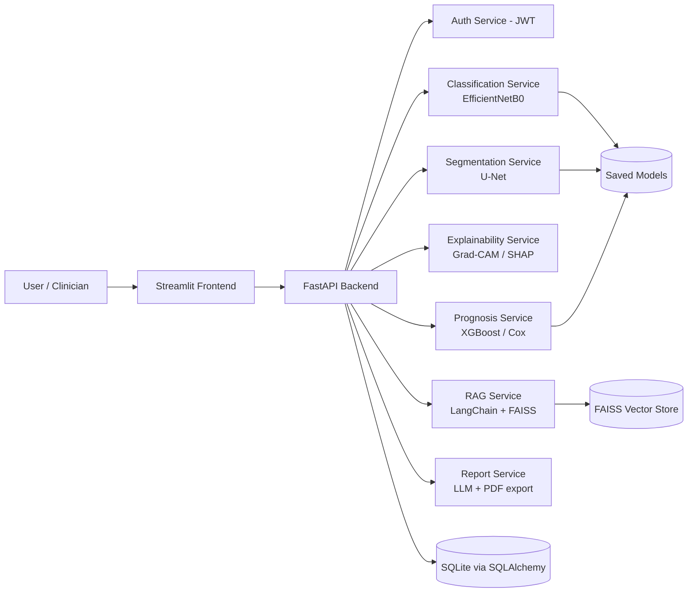

# NeuroVision AI

AI-powered brain tumor diagnosis, segmentation, explainability, medical report
generation, and a medical RAG assistant — built as a modular, production-style
system.

> **Status:** scaffold stage. This repo currently contains the full project
> architecture, configuration layer, database layer, and a running FastAPI +
> Streamlit skeleton. Modules (classification, segmentation, XAI, RAG,
> multimodal, prognosis) are being built out incrementally on top of this
> foundation — see [`docs/ROADMAP.md`](docs/ROADMAP.md).

---

## 1. What this system does

A clinician uploads a brain MRI. The system:

1. **Classifies** the scan (glioma / meningioma / pituitary / no tumor)
2. **Segments** the tumor region (U-Net)
3. **Explains** the prediction (Grad-CAM / Grad-CAM++ / SHAP)
4. **Generates a structured report** (findings, impression, recommendation)
5. **Answers medical questions** via a RAG pipeline grounded in guideline PDFs
6. **Fuses MRI + patient metadata** (age, sex, symptoms, history) for a richer
   prediction
7. **Estimates prognosis** (recurrence risk, survival curves)

## 2. Architecture



## 3. Project structure

```
NeuroVisionAI/
├── backend/                # FastAPI application
│   ├── api/
│   │   ├── routers/        # /predict /segment /explain /report /ask /prognosis /upload /history
│   │   ├── services/       # business logic, calls into ML modules
│   │   └── schemas/        # Pydantic request/response models
│   ├── auth/                # JWT auth, password hashing, role-based access
│   ├── core/                 # app factory, exception handlers, dependencies
│   ├── database/             # SQLAlchemy models, session, migrations
│   └── utils/
├── frontend/                # Streamlit multi-page app
├── training/                 # training scripts per module
│   ├── classification/       # EfficientNetB0 fine-tuning
│   ├── segmentation/         # U-Net training
│   ├── multimodal/           # dual-input fusion model
│   └── prognosis/            # XGBoost / Cox model training
├── classification/           # inference-time classification package
├── segmentation/              # inference-time segmentation package
├── xai/                        # Grad-CAM, Grad-CAM++, SHAP
├── rag/                        # ingestion, embeddings, FAISS store, QA chain
├── reports/                    # report templates + generated PDFs
├── prognosis/                  # risk scoring, survival analysis
├── multimodal/                 # fusion model inference wrapper
├── models/saved_models/        # trained model artifacts (.h5 / .pt / .pkl)
├── datasets/                   # raw / processed / splits (gitignored)
├── config/                     # settings.py (env-driven), logging_config.py, config.yaml
├── tests/                      # pytest suite mirroring the package layout
├── docs/                       # architecture docs, diagrams, guides
├── docker/                     # Dockerfiles for backend/frontend
├── docker-compose.yml
├── requirements.txt
└── .env.example
```

## 4. Tech stack

| Layer | Choice |
|---|---|
| Language | Python 3.12 |
| Backend | FastAPI, Pydantic v2, SQLAlchemy 2.0, SQLite |
| Frontend | Streamlit |
| Vision models | TensorFlow/Keras — EfficientNetB0 (classification), U-Net (segmentation) |
| Explainability | Grad-CAM, Grad-CAM++, SHAP |
| Tabular / survival | XGBoost, Optuna, lifelines (Cox PH, Kaplan-Meier) |
| RAG | LangChain, FAISS, sentence-transformers, PyMuPDF |
| Auth | JWT (python-jose), passlib (bcrypt) |
| Ops | Docker, Docker Compose, Nginx, python-dotenv, YAML config |
| Testing | Pytest |

## 5. Getting started

```bash
# 1. clone & enter
git clone <your-repo-url> && cd NeuroVisionAI

# 2. environment
cp .env.example .env
python -m venv .venv && source .venv/bin/activate
pip install -r requirements.txt

# 3. run the backend
uvicorn backend.main:app --reload --port 8000

# 4. run the frontend (separate terminal)
streamlit run frontend/app.py

# 5. or run everything with Docker
docker compose up --build
```

API docs (Swagger) are then available at `http://localhost:8000/docs`.

## 6. Datasets

This repo does **not** ship datasets or trained weights. Place data under
`datasets/raw/` following the layout documented in
[`docs/DATASETS.md`](docs/DATASETS.md):

- Brain Tumor MRI Dataset (classification)
- LGG Segmentation Dataset (segmentation masks)
- TCGA clinical metadata (multimodal + prognosis)
- WHO / NCCN guideline PDFs + relevant papers (RAG corpus)

## 7. Roadmap

See [`docs/ROADMAP.md`](docs/ROADMAP.md) for the build order and current
status of each module.

## 8. Disclaimer

NeuroVision AI is a research / portfolio engineering project. It is **not**
a certified medical device and must not be used for real clinical
decision-making.
# NeuroVisionAI-
